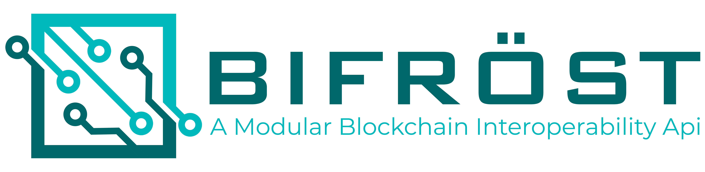

# Bifröst: a Modular Blockchain Interoperability API

<p align="center">
</img>
</p>

The blockchain (BC) world is rapidly becoming a universe of several ledgers designed for a specific purpose, holding data previously stored (i.e., siloed) in centralized databases. The use of different BCs for the same purpose could hamper the frictionless exchange of data or value. On one hand, it is natural that there are competing implementations exploring the benefits of BC. On the other hand, the problem of siloed data re-emerges, with respect to isolated chains. In this regard, BC interoperability is necessary to connect different BCs, exchanging information and assets. Moreover, to foster BC employment, developers must be able to interact with such different BCs without knowing the details of each implementation. This paper presents a novel solution, called Bifröst, to store and retrieve data on different BCs. Bifröst employs a notary scheme, which allows for connectivity to different BCs. The presented prototype is highly modular and currently implements seven adapters to popular BC implementations, including Bitcoin, Ethereum, and Stellar. The developed prototype was evaluated concerning performance, security, and data size to verify the feasibility of such an implementation and assess design decisions taken during its development.

## Usage

```python
from api import store, retrieve, migrate, Blockchain

tx_hash = store('Some Data', Blockchain.STELLAR)    

data = retrieve('[Transaction_Hash]')    

tx_hash = migrate('[Transaction_Hash]', Blockchain.ETHEREUM)
```

Or use the CLI:
```python
source venv/bin/activate

python3 cli.py
```


## Setup

Python 3.6.6 (also tested with 3.6.5) was used for this project. It was tested on MacOS and Ubuntu 18.

### Install Docker
(Linux) Follow [this](https://www.digitalocean.com/community/tutorials/how-to-install-and-use-docker-on-ubuntu-18-04) or [this](https://docs.docker.com/install/linux/docker-ce/ubuntu/#install-docker-ce-1) manual and then do `sudo apt-get install docker-compose`    

(Mac) Install from https://docs.docker.com/docker-for-mac/install/

### Setup virtual environment (venv)
(Linux Only) Install venv:    
`sudo apt-get install python3-venv`    
Create environment:    
`python3 -m venv venv`    
Activate environment:    
`source venv/bin/activate`    
The python version of the environment will be the one with which the environment is created.    
       

### Install dependencies

#### Preparation
First, upgrade pip: `pip install --upgrade pip`     
(Linux only)`sudo apt-get install build-essential libssl-dev libffi-dev python3-dev`

*Upgrade pip on <3.6:*    
(Mac only) Use this command if upgrading upgrading pip fails due to SSL cert error:    
`curl https://bootstrap.pypa.io/get-pip.py | python`

#### Install/Export Dependencies  
Import/Install depenencies: `venv/bin/pip install -r requirements.txt`    
Export: `venv/bin/pip freeze > requirements.txt`    

### Database Setup
(Mac Only) Install sqlite: `brew install sqlite3`    
Then import and setup the DB:    
```
import db.database
db.database.setup()
```

Calling the `setup` function of the [`database`](database.py) module will:

1. drop `credentials` and `transactions` tables if they already exist
2. create tables for storing `credentials` and `transactions`
3. seed the `credentials` table with credentials 
4. seed the `transactions` table with input transactions

Seed values are read from the [`config`](config.py) module.

### Blockchain Setup

See descriptions in [SETUP.md](SETUP.md) for instruction to setup the local nodes.
